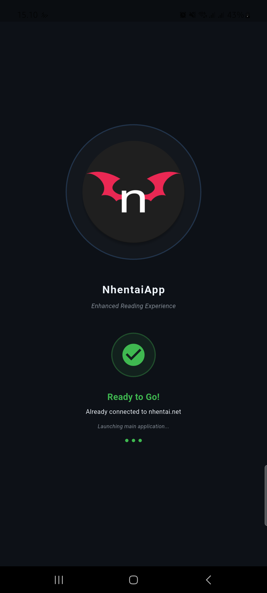
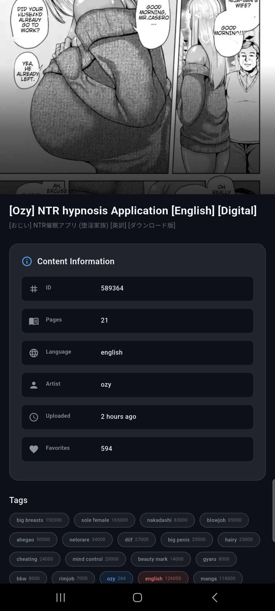
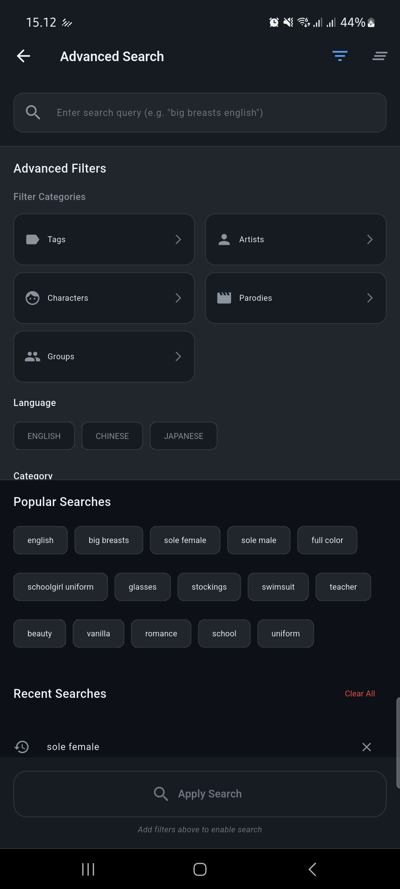

# 📱 NhasixApp - Enhanced Mobile Reading Experience


> **⚠️ 18+ ONLY** • **Android Only** • **Enhanced Reading Experience**

**NhasixApp** is a Flutter Android app that provides **70% faster content loading**, smart offline reading, and modern UI. Built with Clean Architecture for optimal performance and user experience.

## 📥 **Download Latest Release**

[📦 **Download v0.3.0-beta**](https://github.com/shirokun20/nhasixapp/releases/tag/v0.3.0-beta)

| **APK Type** | **Size** | **Target Devices** | **Status** |
|--------------|----------|-------------------|------------|
| **ARM64** ⭐ | 24MB | Modern devices (2019+) | ✅ Available |
| **ARM32** | 22MB | Older devices (2015-2019) | ✅ Available |
| **Universal** | 22MB | All devices | ✅ Available |

> **💡 Tip**: Choose ARM64 for modern devices, ARM32 for older devices. All APKs are available in the [GitHub Releases](https://github.com/shirokun20/nhasixapp/releases/tag/v0.3.0-beta) page.

## ✨ **Key Features**

### 🎯 **Core Reading Experience**
- **Clean, modern interface** optimized for mobile reading
- **High-quality image rendering** with zoom and pan support
- **Full-screen reading mode** for immersive experience
- **Smooth page transitions** with gesture controls
- **Reading progress tracking** with automatic bookmarks

### 🔍 **Advanced Search & Discovery**
- **Powerful search engine** with tag and category filters
- **Advanced filtering** by popularity, date, and tags
- **Smart recommendations** based on reading history
- **Bookmark management** with offline access

### 💾 **Offline & Download Features**
- **Full offline reading** - download for reading without internet
- **Range downloads** - download specific pages or chapters
- **Private downloads** - content hidden from system gallery
- **Download progress tracking** with visual indicators
- **Background downloads** - continue browsing while downloading
- **Bulk delete operations** - select and delete multiple downloads efficiently

### 🎨 **User Experience**
- **Responsive design** that works on all screen sizes
- **Dark/Light theme** support with system preference detection
- **Gesture navigation** - swipe, pinch, and tap controls
- **Modern UI** with Material Design 3 components

### 🚀 **Performance & Privacy**
- **70% faster loading** with smart image preloader
- **Private downloads** hidden from system gallery (`.nomedia`)
- **Optimized builds** for different device architectures
- **Smart caching** and memory management

## 🛠️ **Tech Stack**

### **Core Framework**
- **Flutter** 3.24+ - Cross-platform mobile development
- **Dart** 3.5+ - Programming language

### **Architecture & State Management**
- **Clean Architecture** - Separation of concerns (Presentation → Domain → Data)
- **Flutter BLoC** - Reactive state management
- **Get It** - Dependency injection
- **Equatable** - Value equality and immutability

### **Data & Storage**
- **SQLite** - Local database for offline data
- **SharedPreferences** - Simple key-value storage
- **Offline-First Architecture** - Intelligent caching

### **Networking & APIs**
- **Dio** - HTTP client for API calls
- **HTML Parser** - Web scraping capabilities
- **Connectivity Plus** - Network connectivity monitoring

### **UI & User Experience**
- **Cached Network Image** - Image caching and loading
- **Photo View** - Image zoom and pan functionality
- **Pull to Refresh** - Pull-to-refresh functionality
- **Shimmer** - Loading skeleton animations

### **Background & System**
- **Flutter Local Notifications** - Local push notifications
- **Wakelock Plus** - Keep screen awake during reading
- **Permission Handler** - Runtime permissions

## 📁 **Project Structure**

```
lib/
├── core/                    # Core utilities and configurations
│   ├── config/             # App configuration
│   ├── constants/          # App constants (colors, styles)
│   ├── di/                 # Dependency injection setup
│   ├── network/            # Network client and managers
│   ├── routing/            # App routing configuration
│   └── utils/              # Utility functions
├── data/                   # Data layer
│   ├── datasources/        # Data sources (local/remote)
│   ├── models/            # Data models
│   ├── repositories/      # Repository implementations
│   └── value_objects/     # Value objects
├── domain/                 # Domain layer
│   ├── entities/          # Domain entities
│   ├── repositories/      # Repository interfaces
│   └── usecases/          # Business logic use cases
├── presentation/          # Presentation layer
│   ├── blocs/            # BLoC state management
│   ├── cubits/           # Cubit state management
│   ├── pages/            # UI screens/pages
│   ├── widgets/          # Reusable UI components
│   └── services/         # UI services
└── utils/                 # Global utilities
```

## 🚀 **Quick Start**

### 📱 **Install APK (Recommended)**
1. **Download** the APK for your device from the [GitHub Releases](https://github.com/shirokun20/nhasixapp/releases/tag/v0.3.0-beta) page
2. **Enable Unknown Sources**: Settings → Security → Unknown Sources
3. **Install** the APK and grant permissions when prompted

### 🛠️ **Build from Source**

#### **Prerequisites**
- Flutter SDK (>=3.5.4)
- Dart SDK (>=3.5.4)
- Android Studio / VS Code
- Android SDK

#### **Installation**
```bash
# Clone the repository
git clone https://github.com/shirokun20/nhasixapp.git
cd nhasixapp

# Install dependencies
flutter pub get

# Run the app
flutter run
```

#### **Build for Release**
```bash
# Android APK
flutter build apk --release

# Android App Bundle (for Google Play Store)
flutter build appbundle --release
```

## 🎮 **How to Use**

### 📱 **Getting Started**
1. **Browse**: Swipe through content feed
2. **Search**: Use search bar with filters
3. **Read**: Tap any item to start reading
4. **Download**: Long press for offline access

### ⚙️ **Key Settings**
- **Theme**: Light/Dark mode toggle
- **Grid Layout**: 2, 3, or 4 columns
- **Download Privacy**: Hidden from gallery
- **Bulk Operations**: Select multiple items

## 🧪 **Testing**

```bash
# Run all tests
flutter test

# Run specific test file
flutter test test/presentation/blocs/splash/splash_bloc_test.dart

# Run tests with coverage
flutter test --coverage

# Analyze code
flutter analyze
```

## 📱 **Screenshots**

### 🏠 Home & Details
<div align="center">
  
  
  
</div>

### 🔍 Reading, Detail & Reading Mode
<div align="center">
  
  
  
</div>

### 📖 Reading, Side Menus, Search & Filters
<div align="center">
  
  
  
</div>

### ⚙️ Filters & Search
<div align="center">
  
  
</div>

## 🆘 **Support & FAQ**

### ❓ **Frequently Asked Questions**

**Q: Why won't the app install?**
A: Enable "Install from Unknown Sources" in Android settings. Make sure you downloaded the correct APK for your device architecture.

**Q: Downloads are not showing in my gallery?**
A: This is intentional! Downloads are private (`.nomedia` protection). Access them through the app's download section.

**Q: The app is slow on my device?**
A: Try the ARM32 APK for older devices, or clear the app cache in Android settings.

**Q: Can I use this on iOS?**
A: Currently Android only. iOS support may be considered for future releases.

### 🛠️ **Troubleshooting**
- **Slow loading**: Check your internet connection and try restarting the app
- **Download issues**: Verify storage permissions and available space
- **Search problems**: Clear app cache or try different search terms
- **Crashes**: Report with your device model and Android version

## 👥 **Contributing**

### 🤝 **How to Contribute**
1. **Fork** the repository
2. **Create** a feature branch (`git checkout -b feature/amazing-feature`)
3. **Commit** your changes (`git commit -m 'Add some amazing feature'`)
4. **Push** to the branch (`git push origin feature/amazing-feature`)
5. **Open** a Pull Request

### 📋 **Contribution Guidelines**
- Follow Flutter/Dart best practices
- Maintain clean architecture principles
- Add tests for new features
- Update documentation as needed
- Ensure code is formatted with `dart format`

## 📜 **License & Legal**

### ⚖️ **Important Notes**
- **18+ Only**: This app contains mature content
- **Educational Use**: For personal and educational purposes only
- **Legal Compliance**: Users responsible for local laws
- **MIT License**: See [LICENSE](LICENSE) for details

### 🤝 **Support Creators**

<div align="center">

**Help keep content creation alive!** 💝

</div>

We believe in supporting the amazing artists and creators who make this content possible. Your support helps them continue creating:

- 🎨 **Original Artwork** - Support through official platforms
- 📝 **Creator Communities** - Join their communities
- 💰 **Patreon/Ko-fi** - Direct financial support
- 🌟 **Official Channels** - Follow their work legitimately

> **Every support counts!** Your contribution helps creators focus on what they love most.

---

<div align="center">

**❤️ Thank you for supporting creators! ❤️**

</div>

---

**⚠️ 18+ Only** • **Android Only** • **MIT License**