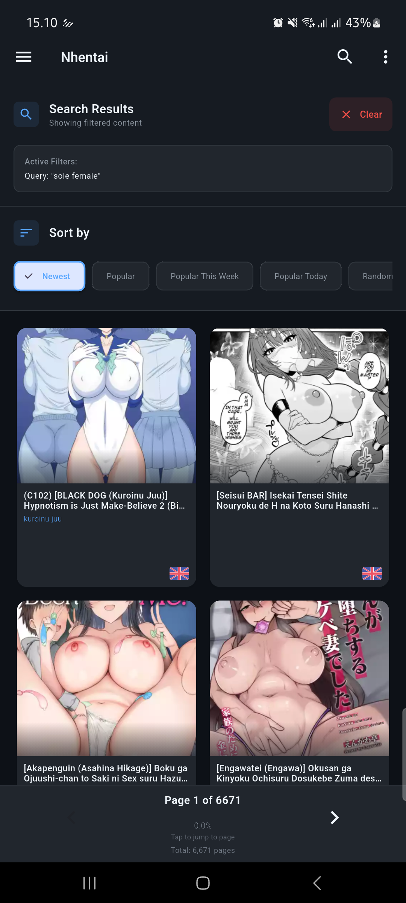
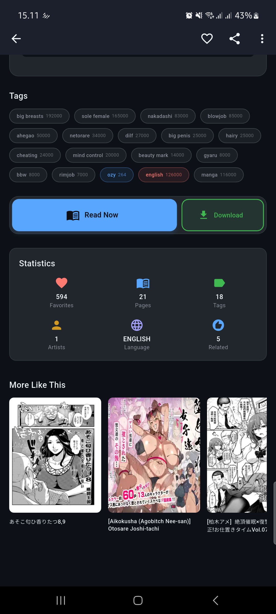

# 📱 NhentaiApp - Flutter Clone


> **⚠️ AGE RESTRICTION WARNING**  
> **This application is intended for users 18 years of age and older only.**  
> **The content accessed through this application may contain mature themes and is not suitable for minors.**  
> **By using this application, you confirm that you are at least 18 years old and legally permitted to access such content in your jurisdiction.**

A comprehensive Flutter Android application that serves as a clone of nhentai.net, built with **Clean Architecture** and modern Flutter development practices. This app provides an enhanced mobile experience for browsing, reading, and managing manga/doujinshi content with offline capabilities.

## 🚀 Features

### 🆕 Recent Updates

- [x] Comprehensive dependency injection setup using get_it for better scalability
- [x] Added external dependencies like SharedPreferences and Connectivity
- [x] Configured core utilities including Logger, Dio HTTP client, CacheManager, TagDataManager
- [x] Setup data sources for remote scraping, anti-detection, cloudflare bypass, and local database
- [x] Implemented repository registrations for content, user data, reader settings, and offline content
- [x] Registered use cases for content, favorites, downloads, and history management
- [x] Configured BLoCs for splash, home, content, search, and download features
- [x] Setup Cubits for network, settings, detail, filter data, reader, offline search, and favorites
- [x] Updated MultiBlocProvider configuration for all BLoCs and Cubits
- [x] Updated dependencies in pubspec.yaml to support new features
- Comprehensive dependency injection setup using get_it for better scalability
- Added external dependencies like SharedPreferences and Connectivity
- Core utilities configured: Logger, Dio HTTP client, CacheManager, TagDataManager
- Data sources for remote scraping, anti-detection, cloudflare bypass, and local database
- Repository implementations for content, user data, reader settings, and offline content
- Use cases for content, favorites, downloads, and history management
- BLoCs for splash, home, content, search, and download features
- Cubits for network, settings, detail, filter data, reader, offline search, and favorites
- Updated MultiBlocProvider configuration for all BLoCs and Cubits
- Updated dependencies in pubspec.yaml to support new features

## 🚀 Features

### 📖 Core Reading Experience
- **Content Browsing** - Browse latest, popular, and random content
- **Advanced Search** - Filter by tags, artists, characters, language, and more
- **Manga Reader** - Smooth reading experience with zoom, pan, and navigation
- **Multiple Reading Modes** - Single page, continuous scroll, dual page support
- **Reading Progress** - Track reading history and progress automatically

### 💾 Offline & Storage
- **Favorites System** - Organize favorites with custom categories
- **Download Manager** - Download content for offline reading with queue management
- **Reading History** - Track reading progress and statistics
- **Offline Reading** - Access downloaded content without internet

### 🎨 Customization
- **Multiple Themes** - Light, Dark, and AMOLED themes with custom color schemes
- **Reader Settings** - Customize reading direction, page transitions, and controls
- **Grid Layouts** - Adjustable grid columns for different screen orientations
- **Content Filtering** - Blacklist tags and customize content visibility

### 🔧 Advanced Features
- **Cloudflare Bypass** - Automatic bypass of website protection
- **Web Scraping** - Direct content extraction from HTML
- **Background Downloads** - Continue downloads in background
- **Statistics Dashboard** - Reading statistics and analytics
- **Backup & Sync** - Export/import user data and settings

## 🏗️ Architecture

## 🛠️ Development Progress

- [x] Comprehensive dependency injection setup using get_it for better scalability
- [x] Added external dependencies like SharedPreferences and Connectivity
- [x] Configured core utilities including Logger, Dio HTTP client, CacheManager, TagDataManager
- [x] Setup data sources for remote scraping, anti-detection, cloudflare bypass, and local database
- [x] Implemented repository registrations for content, user data, reader settings, and offline content
- [x] Registered use cases for content, favorites, downloads, and history management
- [x] Configured BLoCs for splash, home, content, search, and download features
- [x] Setup Cubits for network, settings, detail, filter data, reader, offline search, and favorites
- [x] Updated MultiBlocProvider configuration for all BLoCs and Cubits
- [x] Updated dependencies in pubspec.yaml to support new features
- [x] Added Cloudflare bypass and web scraping features
- [x] Implemented background download support
- [x] Added statistics dashboard and backup & sync functionality

## 🏗️ Architecture

This project follows **Clean Architecture** principles with clear separation of concerns:

```
lib/
├── 📁 core/                    # Core utilities and configuration
│   ├── config/                 # App configuration
│   ├── constants/              # App constants and themes
│   ├── di/                     # Dependency injection setup
│   ├── routing/                # Navigation and routing
│   └── utils/                  # Utility functions
├── 📁 data/                    # Data layer
│   ├── datasources/            # Remote and local data sources
│   ├── models/                 # Data models and DTOs
│   └── repositories/           # Repository implementations
├── 📁 domain/                  # Domain layer (Business Logic)
│   ├── entities/               # Core business entities
│   ├── repositories/           # Repository interfaces
│   ├── usecases/               # Business use cases
│   └── value_objects/          # Value objects for type safety
├── 📁 presentation/            # Presentation layer
│   ├── blocs/                  # BLoC state management
│   ├── pages/                  # Screen implementations
│   └── widgets/                # Reusable UI components
└── main.dart                   # Application entry point
```

## 🛠️ Tech Stack

### **Core Framework**
- **Flutter** - Cross-platform mobile development
- **Dart** - Programming language

### **Offline-First Strategy**
- **Intelligent Caching** - 6-hour cache expiration with automatic refresh
- **Fallback Mechanisms** - Cache → Remote → Cache fallback pattern
- **Error Handling** - Comprehensive error handling with graceful degradation
- **Performance Optimization** - Database transactions and memory management

### **Data Models (Simplified)**
- **DownloadStatusModel** - Download progress tracking with title and cover
- **HistoryModel** - Reading history with title and cover for display
- **UserPreferences** - User settings and preferences
- **SearchFilter** - Advanced search filtering

## 🎯 Recent Implementation: ContentBloc with Advanced Features

### **Key Features Implemented**
- **🔄 Advanced State Management** - Loading, loaded, error states with pagination support
- **📱 Pull-to-Refresh** - SmartRefresher integration for seamless content updates
- **♾️ Infinite Scrolling** - Automatic load more with performance optimization
- **🎯 Content Management** - Complete content browsing with caching strategy
- **🛡️ Error Handling** - Comprehensive error handling with retry mechanisms
- **💾 LocalDataSource Integration** - Full SQLite database operations ready
- **🧪 Comprehensive Testing** - 10/10 unit tests + 8/8 integration tests passing

### **ContentBloc State Flow**
```
ContentInitial → ContentLoading → ContentLoaded (with pagination)
                              ↘ ContentError (with retry)
ContentRefreshing → ContentLoaded (pull-to-refresh)
ContentLoadingMore → ContentLoaded (infinite scroll)
```

### **LocalDataSource Capabilities (Simplified)**
- **Favorites System**: Simple ID + cover URL storage
- **Download Tracking**: Basic status monitoring with title and cover
- **History Management**: Reading progress with title and cover for display
- **User Preferences**: Settings and customization storage
- **Search History**: Recent search queries management
- **Database Optimization**: Lightweight schema with 5 tables only

## 🛠️ Tech Stack

### **Core Framework**
- **Flutter** - Cross-platform mobile development
- **Dart** - Programming language

### **Architecture & State Management**
- **Clean Architecture** - Separation of concerns
- **BLoC Pattern** - Reactive state management with `flutter_bloc`
- **Get It** - Dependency injection
- **Equatable** - Value equality and immutability

### **Navigation & Routing**
- **Go Router** - Declarative routing with deep linking support

### **Data & Storage**
- **SQLite** (`sqflite`) - Local database for caching and offline data
- **SharedPreferences** - Simple key-value storage for settings
- **Path Provider** - File system access
- **Offline-First Architecture** - Intelligent caching with fallback mechanisms

### **Networking & Web Scraping**
- **Dio** - HTTP client for API calls
- **HTML Parser** - HTML parsing for web scraping
- **WebView Flutter** - Cloudflare bypass integration
- **Connectivity Plus** - Network connectivity monitoring

### **Image Handling**
- **Cached Network Image** - Image caching and loading
- **Photo View** - Image zoom and pan functionality
- **Image** - Image processing and manipulation

### **UI & User Experience**
- **Flutter Staggered Grid View** - Masonry grid layouts
- **Pull to Refresh** - Pull-to-refresh functionality
- **Flutter Slidable** - Swipe actions
- **Badges** - Notification badges
- **Shimmer** - Loading skeleton animations
- **Lottie** - Advanced animations

### **Background & Notifications**
- **Flutter Local Notifications** - Local push notifications
- **Wakelock Plus** - Keep screen awake during reading

### **File Management**
- **File Picker** - File selection for import/export
- **Share Plus** - Content sharing functionality
- **Open File** - Open downloaded files

### **Utilities**
- **Logger** - Comprehensive logging system
- **Permission Handler** - Runtime permissions
- **Crypto** - Cryptographic operations
- **Intl** - Internationalization support
- **Package Info Plus** - App information
- **Device Info Plus** - Device information

### **Testing & Development**
- **BLoC Test** - Testing utilities for BLoC state management
- **Mockito** - Mock generation for unit testing
- **Build Runner** - Code generation for mocks and other build tasks
- **Flutter Test** - Core testing framework
- **Flutter Lints** - Code quality and style enforcement

## 📋 Development Progress

### ✅ **Completed Major Features (~70%)**
- [x] **Core Architecture**: Clean Architecture with BLoC/Cubit pattern
- [x] **Search System**: SearchBloc, FilterDataScreen, TagDataManager, Matrix Filter Support
- [x] **Reader System**: ReaderCubit with 3 reading modes, settings persistence, progress tracking
- [x] **UI Framework**: Comprehensive widgets with modern design (ColorsConst, TextStyleConst)
- [x] **Navigation**: Go Router with deep linking and parameter passing
- [x] **Database**: SQLite with search state persistence and reader settings
- [x] **Web Scraping**: NhentaiScraper with anti-detection and TagResolver

### ✅ **Completed Tasks (1-7)**
- [x] **Task 1**: Project structure and core dependencies setup
- [x] **Task 2**: Core domain layer implementation
- [x] **Task 3**: Data layer foundation (Simplified)
- [x] **Task 4**: Core BLoC state management
  - [x] SplashBloc, ContentBloc, SearchBloc, HomeBloc
  - [x] DetailCubit, ReaderCubit, FilterDataCubit
- [x] **Task 5**: Core UI components
  - [x] AppMainDrawerWidget, AppMainHeaderWidget, ContentListWidget
  - [x] PaginationWidget, SortingWidget, FilterDataSearchWidget
- [x] **Task 6**: Advanced search flow
  - [x] SearchScreen, FilterDataScreen, TagDataManager
  - [x] Matrix Filter Support, state persistence
- [x] **Task 7**: Reader functionality
  - [x] ReaderScreen with 3 reading modes
  - [x] Settings persistence, progress tracking, gesture navigation
- [x] **Task 8**: Favorites and download system
  - [x] FavoritesScreen with FavoriteCubit
  - [x] DownloadBloc with queue system
  - [x] Offline reading capabilities

### 🎯 **Next Priority Features (30% Remaining)**
- [ ] **Task 9**: Settings and preferences
  - [ ] SettingsScreen with SettingsCubit
  - [ ] Theme customization and backup functionality
- [ ] **Task 10**: Advanced features and network management
  - [ ] NetworkCubit for connectivity monitoring
  - [ ] Tag management and history statistics
- [ ] **Task 11**: Performance optimization and testing
  - [ ] Memory management and real device testing
  - [ ] Project cleanup and documentation
- [ ] **Task 12**: UI polish and accessibility
  - [ ] Animations, loading skeletons, accessibility features
- [ ] **Task 13**: Deployment preparation
  - [ ] App branding, build configuration, release testing

## 🚀 Getting Started

### Prerequisites
- Flutter SDK (>=3.5.4)
- Dart SDK (>=3.5.4)
- Android Studio / VS Code
- Android SDK

### Installation

1. **Clone the repository**
   ```bash
   git clone <repository-url>
   cd nhasixapp
   ```

2. **Install dependencies**
   ```bash
   flutter pub get
   ```

3. **Run the app**
   ```bash
   flutter run
   ```

### Build for Release

```bash
# Android APK
flutter build apk --release

# Android App Bundle (for Google Play Store)
flutter build appbundle --release
```

## 🧪 Testing

The project includes comprehensive testing with mocking for reliable unit tests:

```bash
# Run all tests
flutter test

# Run specific test file
flutter test test/presentation/blocs/splash/splash_bloc_test.dart

# Run tests with coverage
flutter test --coverage

# Generate mock files
flutter packages pub run build_runner build

# Analyze code
flutter analyze
```

### **Test Coverage**
- **SplashBloc Tests** - Complete state management testing with mocked dependencies
- **ContentBloc Tests** - 10/10 unit tests + 8/8 integration tests passing
- **Repository Tests** - Data layer testing with offline-first scenarios
- **Use Case Tests** - Business logic validation
- **Integration Tests** - End-to-end testing for critical flows
- **Real Connection Tests** - Verified nhentai.net connectivity

## 📱 Screenshots

### 🏠 Home & Details
<div align="center">
  
  
  
</div>

### 🔍 Reading, Detail & Reading Mode
<div align="center">
  
  
  
</div>

### 📖 Reading, Side Menus, Search & Filters
<div align="center">
  
  
  
</div>

### ⚙️ Filters & Search
<div align="center">
  
  
</div>

> **Note**: Screenshots showcase the current development progress with modern Material Design 3 UI components and responsive layouts.

## 📚 Development References

This project includes comprehensive reference materials for development and testing:

### **HTML Reference Files**
Located in `references/` directory, these files contain real website structure for development:

- **`halaman_utama.html`** - Main page structure and content grid layout
- **`halaman_search.html`** - Search results page with filtering options
- **`halaman_detail.html`** - Content detail page with metadata and tags
- **`halaman_baca.html`** - Reader page with image gallery structure
- **`halaman_last_page.html`** - Pagination and navigation structure

### **JSON Data References**
- **`halaman_detail.json`** - Structured content metadata for API development

### **Usage in Development**
These reference files are used for:
- **Web Scraping Development** - Understanding HTML structure for parsing
- **UI/UX Design Reference** - Matching original website layout and functionality
- **Testing Data** - Providing realistic test scenarios
- **API Structure Planning** - Defining data models and response formats

## 🤝 Contributing

This project follows Clean Architecture principles and uses BLoC for state management. When contributing:

1. Follow the established architecture patterns
2. Write comprehensive tests for new features
3. Update documentation for significant changes
4. Follow Dart/Flutter style guidelines
5. Use the reference files in `references/` for understanding website structure
6. Test with real data scenarios using provided HTML samples

## ⚖️ Legal Notice

**AGE RESTRICTION:** This application is strictly intended for users who are 18 years of age or older. The content accessed through this application contains mature themes and adult material that is not suitable for minors.

This application is created for educational purposes and personal use only. It demonstrates modern Flutter development practices and Clean Architecture implementation. Users are responsible for:
- Verifying they meet the minimum age requirement (18+) in their jurisdiction
- Complying with applicable laws and terms of service of content sources
- Using the application responsibly and legally

By downloading, installing, or using this application, you acknowledge and confirm that you are at least 18 years old and legally permitted to access adult content in your location.

## 📄 License

This project is licensed under the MIT License - see the [LICENSE](LICENSE) file for details.

## 🙏 Acknowledgments

- Flutter team for the amazing framework
- BLoC library maintainers for excellent state management
- Clean Architecture principles by Robert C. Martin
- Open source community for the fantastic packages used

---

## 📊 Project Statistics

- **Architecture**: Clean Architecture with 3 layers
- **State Management**: BLoC/Cubit Pattern with proper separation
- **Dependencies**: 45+ carefully selected packages
- **Test Coverage**: Unit tests with mocking for critical components
- **Development Progress**: 70% complete (7/13 tasks)
- **Implementation Status**: Core features operational
- **Target Platform**: Android
- **Minimum SDK**: Android API 21+ (Android 5.0)
- **Latest Achievement**: Complete search system and reader functionality with advanced features ✨

---

**Built with ❤️ using Flutter and Clean Architecture**

---

## 🌐 Other Languages

- [English](README.md) ← You are here
- [Bahasa Indonesia](README_ID.md)