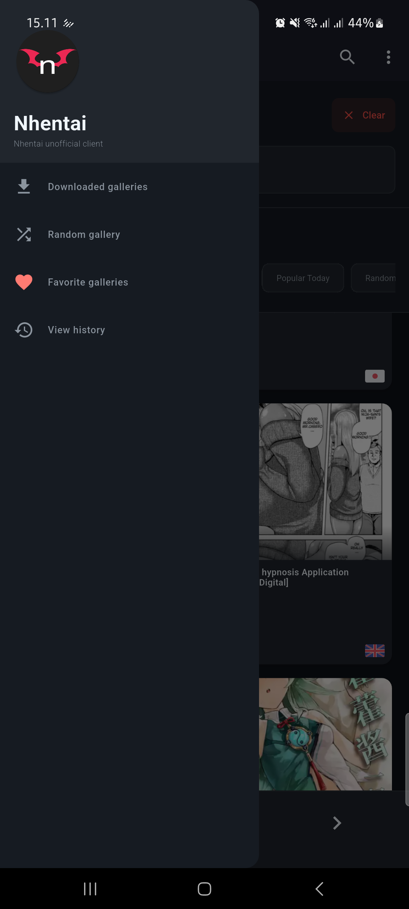
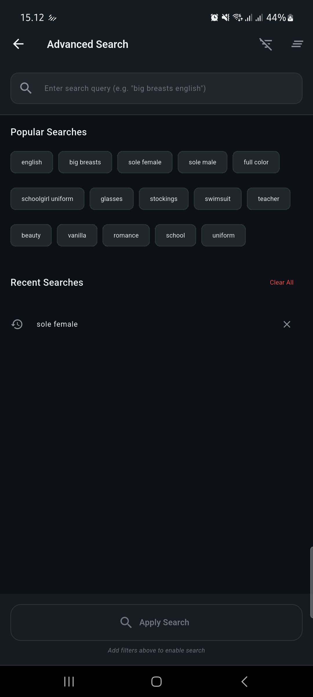

# 📱 NhasixApp - Pengalaman Membaca Mobile yang Ditingkatkan


> **⚠️ 18+ SAJA** • **Android Only** • **Pengalaman Membaca Ditingkatkan**

**NhasixApp** adalah aplikasi Flutter Android yang menyediakan **70% pemuatan konten lebih cepat**, membaca offline cerdas, dan UI modern. Dibangun dengan Clean Architecture untuk performa optimal.

## 📥 **Download Rilis Terbaru**

[📦 **Download v0.3.0-beta**](https://github.com/shirokun20/nhasixapp/releases/tag/v0.3.0-beta)

| **Jenis APK** | **Ukuran** | **Target Perangkat** | **Status** |
|--------------|----------|-------------------|------------|
| **ARM64** ⭐ | 24MB | Perangkat modern (2019+) | ✅ Tersedia |
| **ARM32** | 22MB | Perangkat lama (2015-2019) | ✅ Tersedia |
| **Universal** | 22MB | Semua perangkat | ✅ Tersedia |

> **💡 Tip**: Pilih ARM64 untuk perangkat modern, ARM32 untuk perangkat lama. Semua APK tersedia di halaman [GitHub Releases](https://github.com/shirokun20/nhasixapp/releases/tag/v0.3.0-beta).

## ✨ **Fitur Utama**

### 🎯 **Pengalaman Membaca Inti**
- **Interface bersih dan modern** dioptimalkan untuk membaca mobile
- **Rendering gambar berkualitas tinggi** dengan dukungan zoom dan pan
- **Mode membaca layar penuh** untuk pengalaman yang imersif
- **Transisi halaman yang halus** dengan kontrol gesture
- **Pelacakan progress baca** dengan bookmark otomatis

### 🔍 **Pencarian & Penemuan Lanjutan**
- **Mesin pencari yang kuat** dengan filter tag dan kategori
- **Filtering lanjutan** berdasarkan popularitas, tanggal, dan tag
- **Rekomendasi cerdas** berdasarkan riwayat baca
- **Manajemen bookmark** dengan akses offline

### 💾 **Fitur Offline & Download**
- **Membaca offline penuh** - download untuk membaca tanpa internet
- **Download rentang** - download halaman atau chapter tertentu
- **Download pribadi** - konten tersembunyi dari galeri sistem
- **Pelacakan progress download** dengan indikator visual
- **Download background** - lanjutkan browsing saat mendownload
- **Operasi bulk delete** - pilih dan hapus multiple download secara efisien

### 🎨 **Pengalaman Pengguna**
- **Desain responsif** yang bekerja di semua ukuran layar
- **Dukungan tema Gelap/Terang** dengan deteksi preferensi sistem
- **Navigasi gesture** - kontrol swipe, pinch, dan tap
- **UI Modern** dengan komponen Material Design 3

### 🚀 **Performa & Privasi**
- **70% pemuatan konten lebih cepat** dengan smart image preloader
- **Download privat** tersembunyi dari galeri sistem (`.nomedia`)
- **Build dioptimalkan** untuk arsitektur perangkat berbeda
- **Smart caching** dan manajemen memori

## 🛠️ **Tech Stack**

### **Framework Inti**
- **Flutter** 3.24+ - Pengembangan mobile cross-platform
- **Dart** 3.5+ - Bahasa pemrograman

### **Arsitektur & State Management**
- **Clean Architecture** - Pemisahan kepentingan (Presentation → Domain → Data)
- **Flutter BLoC** - Manajemen state reaktif
- **Get It** - Dependency injection
- **Equatable** - Kesetaraan nilai dan immutability

### **Data & Storage**
- **SQLite** - Database lokal untuk data offline
- **SharedPreferences** - Penyimpanan key-value sederhana
- **Offline-First Architecture** - Intelligent caching

### **Networking & APIs**
- **Dio** - HTTP client untuk pemanggilan API
- **HTML Parser** - Kemampuan web scraping
- **Connectivity Plus** - Monitoring konektivitas jaringan

### **UI & Pengalaman Pengguna**
- **Cached Network Image** - Caching dan loading gambar
- **Photo View** - Fungsi zoom dan pan gambar
- **Pull to Refresh** - Fungsi pull-to-refresh
- **Shimmer** - Animasi skeleton loading

### **Background & Sistem**
- **Flutter Local Notifications** - Notifikasi push lokal
- **Wakelock Plus** - Menjaga layar tetap menyala saat membaca
- **Permission Handler** - Runtime permissions

## 📁 **Struktur Proyek**

```
lib/
├── core/                    # Utilitas dan konfigurasi inti
│   ├── config/             # Konfigurasi aplikasi
│   ├── constants/          # Konstanta aplikasi (warna, gaya)
│   ├── di/                 # Setup dependency injection
│   ├── network/            # Klien jaringan dan manager
│   ├── routing/            # Konfigurasi routing aplikasi
│   └── utils/              # Fungsi utilitas
├── data/                   # Layer data
│   ├── datasources/        # Sumber data (lokal/remote)
│   ├── models/            # Model data
│   ├── repositories/      # Implementasi repository
│   └── value_objects/     # Value objects
├── domain/                 # Layer domain
│   ├── entities/          # Entitas domain
│   ├── repositories/      # Interface repository
│   └── usecases/          # Logika bisnis use cases
├── presentation/          # Layer presentation
│   ├── blocs/            # Manajemen state BLoC
│   ├── cubits/           # Manajemen state Cubit
│   ├── pages/            # Layar/halaman UI
│   ├── widgets/          # Komponen UI yang dapat digunakan ulang
│   └── services/         # Layanan UI
└── utils/                 # Utilitas global
```

## 🚀 **Mulai Cepat**

## 🚀 **Mulai Cepat**

### 📱 **Install APK (Direkomendasikan)**
1. **Download** APK untuk perangkat Anda dari halaman [GitHub Releases](https://github.com/shirokun20/nhasixapp/releases/tag/v0.3.0-beta)
2. **Aktifkan Sumber Tidak Dikenal**: Pengaturan → Keamanan → Sumber Tidak Dikenal
3. **Install** APK dan berikan izin saat diminta

### 🛠️ **Build dari Source**

#### **Prasyarat**
- Flutter SDK (>=3.5.4)
- Dart SDK (>=3.5.4)
- Android Studio / VS Code
- Android SDK

#### **Instalasi**
```bash
# Clone repository
git clone https://github.com/shirokun20/nhasixapp.git
cd nhasixapp

# Install dependensi
flutter pub get

# Jalankan aplikasi
flutter run
```

#### **Build untuk Release**
```bash
# Android APK
flutter build apk --release

# Android App Bundle (untuk Google Play Store)
flutter build appbundle --release
```

---

## 🎮 **Cara Menggunakan**

### 📱 **Memulai**
1. **Browse**: Swipe melalui feed konten
2. **Cari**: Gunakan search bar dengan filter
3. **Baca**: Ketuk item untuk mulai membaca
4. **Download**: Long press untuk akses offline

### ⚙️ **Pengaturan Utama**
- **Tema**: Toggle mode terang/gelap
- **Grid Layout**: 2, 3, atau 4 kolom
- **Download Privat**: Tersembunyi dari galeri
- **Operasi Batch**: Pilih multiple item

## 📱 **Screenshot**

### 🏠 Beranda & Detail
<div align="center">
  
  
  
</div>

### 🔍 Membaca, Detail & Mode Membaca
<div align="center">
  
  
  
</div>

### 📖 Membaca, Menu Samping, Pencarian & Filter
<div align="center">
  
  
  
</div>

### ⚙️ Filter & Pencarian
<div align="center">
  
  
</div>

## 🆘 **Dukungan & FAQ**

### ❓ **Pertanyaan yang Sering Diajukan**

**T: Mengapa aplikasi tidak bisa diinstal?**
J: Aktifkan "Instal dari Sumber Tidak Dikenal" di pengaturan Android. Pastikan Anda mendownload APK yang benar untuk arsitektur perangkat Anda.

**T: Download tidak muncul di galeri saya?**
J: Ini disengaja! Download bersifat privat (perlindungan `.nomedia`). Akses melalui bagian download aplikasi.

**T: Aplikasi lambat di perangkat saya?**
J: Coba APK ARM32 untuk perangkat lama, atau hapus cache aplikasi di pengaturan Android.

**T: Bisakah saya menggunakan ini di iOS?**
J: Saat ini hanya Android. Dukungan iOS mungkin dipertimbangkan untuk rilis masa depan.

### 🛠️ **Troubleshooting**
- **Loading lambat**: Periksa koneksi internet dan coba restart aplikasi
- **Masalah download**: Verifikasi izin storage dan ruang yang tersedia
- **Masalah pencarian**: Hapus cache aplikasi atau coba kata pencarian berbeda
- **Crash**: Laporkan dengan model perangkat dan versi Android Anda

## 👥 **Berkontribusi**

### 🤝 **Cara Berkontribusi**
1. **Fork** repository
2. **Buat** branch fitur (`git checkout -b feature/fitur-amazing`)
3. **Commit** perubahan Anda (`git commit -m 'Tambahkan fitur amazing'`)
4. **Push** ke branch (`git push origin feature/fitur-amazing`)
5. **Buka** Pull Request

### 📋 **Panduan Kontribusi**
- Ikuti best practice Flutter/Dart
- Pertahankan prinsip clean architecture
- Tambahkan test untuk fitur baru
- Update dokumentasi sesuai kebutuhan
- Pastikan kode diformat dengan `dart format`

## 🧪 **Testing**

```bash
# Jalankan semua test
flutter test

# Jalankan file test spesifik
flutter test test/presentation/blocs/splash/splash_bloc_test.dart

# Jalankan test dengan coverage
flutter test --coverage

# Analisis kode
flutter analyze
```

---

## 📜 **Lisensi & Legal**

### ⚖️ **Catatan Penting**
- **18+ Saja**: App ini mengandung konten dewasa
- **Penggunaan Edukasi**: Untuk tujuan pribadi dan edukasi saja
- **Kepatuhan Legal**: Pengguna bertanggung jawab atas hukum lokal
- **Lisensi MIT**: Lihat [LICENSE](LICENSE) untuk detail

### 🤝 **Dukung Creator**

<div align="center">

**Bantu pembuat tetap hidup!** 💝

</div>

Kami percaya untuk mendukung seniman dan kreator hebat yang membuat konten ini mungkin. Dukungan Anda membantu mereka terus berkarya:

- 🎨 **Karya Asli** - Dukung melalui platform resmi
- 📝 **Komunitas Kreator** - Bergabung dengan komunitas mereka
- 💰 **Patreon/Ko-fi** - Dukungan finansial langsung
- 🌟 **Channel Resmi** - Ikuti karya mereka secara sah

> **Setiap dukungan berarti!** Kontribusi Anda membantu kreator fokus pada apa yang mereka cintai.

---

<div align="center">

**❤️ Terima kasih telah mendukung kreator! ❤️**

</div>

---

**⚠️ Hanya 18+ ** • **Android Saja** • **MIT License**