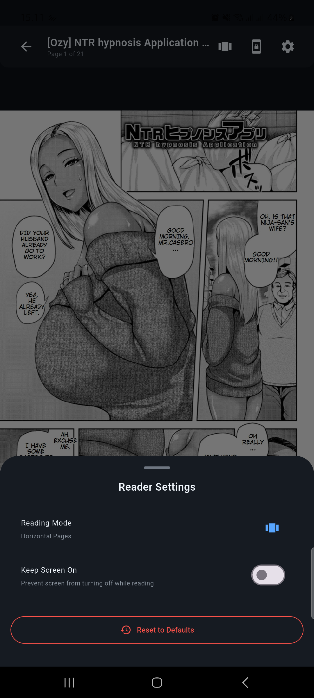

# 📱 NhentaiApp - Flutter Clone


> **⚠️ PERINGATAN PEMBATASAN USIA**  
> **Aplikasi ini hanya ditujukan untuk pengguna berusia 18 tahun ke atas.**  
> **Konten yang diakses melalui aplikasi ini mungkin mengandung tema dewasa dan tidak cocok untuk anak di bawah umur.**  
> **Dengan menggunakan aplikasi ini, Anda mengkonfirmasi bahwa Anda berusia minimal 18 tahun dan diizinkan secara hukum untuk mengakses konten tersebut di wilayah hukum Anda.**

Aplikasi Android Flutter yang komprehensif yang berfungsi sebagai clone dari nhentai.net, dibangun dengan **Clean Architecture** dan praktik pengembangan Flutter modern. Aplikasi ini menyediakan pengalaman mobile yang ditingkatkan untuk browsing, membaca, dan mengelola konten manga/doujinshi dengan kemampuan offline.

## 🚀 Fitur

### 🆕 Pembaruan Terbaru

- [x] Setup dependency injection komprehensif menggunakan get_it untuk skalabilitas lebih baik
- [x] Menambahkan dependensi eksternal seperti SharedPreferences dan Connectivity
- [x] Konfigurasi utilitas inti: Logger, Dio HTTP client, CacheManager, TagDataManager
- [x] Data source untuk scraping remote, anti-detection, bypass cloudflare, dan database lokal
- [x] Implementasi repository untuk konten, data pengguna, pengaturan pembaca, dan konten offline
- [x] Use case untuk konten, favorit, unduhan, dan manajemen riwayat
- [x] BLoC untuk splash, home, konten, pencarian, dan fitur unduhan
- [x] Cubit untuk network, pengaturan, detail, filter data, pembaca, pencarian offline, dan favorit
- [x] Konfigurasi MultiBlocProvider diperbarui untuk semua BLoC dan Cubit
- [x] Dependensi di pubspec.yaml diperbarui untuk mendukung fitur baru
- Setup dependency injection komprehensif menggunakan get_it untuk skalabilitas lebih baik
- Menambahkan dependensi eksternal seperti SharedPreferences dan Connectivity
- Konfigurasi utilitas inti: Logger, Dio HTTP client, CacheManager, TagDataManager
- Data source untuk scraping remote, anti-detection, bypass cloudflare, dan database lokal
- Implementasi repository untuk konten, data pengguna, pengaturan pembaca, dan konten offline
- Use case untuk konten, favorit, unduhan, dan manajemen riwayat
- BLoC untuk splash, home, konten, pencarian, dan fitur unduhan
- Cubit untuk network, pengaturan, detail, filter data, pembaca, pencarian offline, dan favorit
- Konfigurasi MultiBlocProvider diperbarui untuk semua BLoC dan Cubit
- Dependensi di pubspec.yaml diperbarui untuk mendukung fitur baru

## 🚀 Fitur

### 📖 Pengalaman Membaca Inti
- **Browsing Konten** - Jelajahi konten terbaru, populer, dan acak
- **Pencarian Lanjutan** - Filter berdasarkan tag, artis, karakter, bahasa, dan lainnya
- **Pembaca Manga** - Pengalaman membaca yang lancar dengan zoom, pan, dan navigasi
- **Mode Membaca Beragam** - Halaman tunggal, scroll berkelanjutan, dukungan halaman ganda
- **Progress Membaca** - Lacak riwayat dan progress membaca secara otomatis

### 💾 Offline & Penyimpanan
- **Sistem Favorit** - Atur favorit dengan kategori kustom
- **Download Manager** - Download konten untuk membaca offline dengan manajemen antrian
- **Riwayat Membaca** - Lacak progress dan statistik membaca
- **Membaca Offline** - Akses konten yang didownload tanpa internet

### 🎨 Kustomisasi
- **Tema Beragam** - Tema Terang, Gelap, dan AMOLED dengan skema warna kustom
- **Pengaturan Pembaca** - Kustomisasi arah baca, transisi halaman, dan kontrol
- **Layout Grid** - Kolom grid yang dapat disesuaikan untuk orientasi layar berbeda
- **Filter Konten** - Blacklist tag dan kustomisasi visibilitas konten

### 🔧 Fitur Lanjutan
- **Bypass Cloudflare** - Bypass otomatis perlindungan website
- **Web Scraping** - Ekstraksi konten langsung dari HTML
- **Download Background** - Lanjutkan download di background
- **Dashboard Statistik** - Statistik dan analitik membaca
- **Backup & Sync** - Export/import data pengguna dan pengaturan

## 🏗️ Arsitektur

## 🛠️ Progres Pengembangan

- [x] Setup dependency injection komprehensif menggunakan get_it untuk skalabilitas lebih baik
- [x] Menambahkan dependensi eksternal seperti SharedPreferences dan Connectivity
- [x] Konfigurasi utilitas inti: Logger, Dio HTTP client, CacheManager, TagDataManager
- [x] Data source untuk scraping remote, anti-detection, bypass cloudflare, dan database lokal
- [x] Implementasi repository untuk konten, data pengguna, pengaturan pembaca, dan konten offline
- [x] Use case untuk konten, favorit, unduhan, dan manajemen riwayat
- [x] BLoC untuk splash, home, konten, pencarian, dan fitur unduhan
- [x] Cubit untuk network, pengaturan, detail, filter data, pembaca, pencarian offline, dan favorit
- [x] Konfigurasi MultiBlocProvider diperbarui untuk semua BLoC dan Cubit
- [x] Dependensi di pubspec.yaml diperbarui untuk mendukung fitur baru
- [x] Menambahkan fitur bypass Cloudflare dan web scraping
- [x] Implementasi dukungan download di background
- [x] Menambahkan dashboard statistik dan fungsi backup & sync

## 🏗️ Arsitektur

Proyek ini mengikuti prinsip **Clean Architecture** dengan pemisahan yang jelas:

```
lib/
├── 📁 core/                    # Utilitas inti dan konfigurasi
│   ├── config/                 # Konfigurasi aplikasi
│   ├── constants/              # Konstanta dan tema aplikasi
│   ├── di/                     # Setup dependency injection
│   ├── routing/                # Navigasi dan routing
│   └── utils/                  # Fungsi utilitas
├── 📁 data/                    # Layer data
│   ├── datasources/            # Sumber data remote dan lokal
│   ├── models/                 # Model data dan DTO
│   └── repositories/           # Implementasi repository
├── 📁 domain/                  # Layer domain (Business Logic)
│   ├── entities/               # Entitas bisnis inti
│   ├── repositories/           # Interface repository
│   ├── usecases/               # Use case bisnis
│   └── value_objects/          # Value object untuk type safety
├── 📁 presentation/            # Layer presentasi
│   ├── blocs/                  # Manajemen state BLoC
│   ├── pages/                  # Implementasi layar
│   └── widgets/                # Komponen UI yang dapat digunakan ulang
└── main.dart                   # Entry point aplikasi
```

## 🗄️ Implementasi Layer Data

### **Pola Repository**
- **ContentRepositoryImpl** - Manajemen konten offline-first dengan caching cerdas
- **UserDataRepositoryImpl** - Manajemen data pengguna lokal (favorit, download, riwayat)
- **SettingsRepositoryImpl** - Manajemen pengaturan berbasis SharedPreferences

### **Sumber Data**
- **LocalDataSource** - Operasi database SQLite dengan CRUD komprehensif
- **RemoteDataSource** - Web scraping dengan anti-deteksi dan bypass Cloudflare
- **DatabaseHelper** - Manajemen skema database dan migrasi

### **Strategi Offline-First**
- **Caching Cerdas** - Ekspirasi cache 6 jam dengan refresh otomatis
- **Mekanisme Fallback** - Pola fallback Cache → Remote → Cache
- **Error Handling** - Error handling komprehensif dengan degradasi yang elegan
- **Optimisasi Performa** - Transaksi database dan manajemen memori

### **Model Data (Disederhanakan)**
- **DownloadStatusModel** - Pelacakan progress download dengan title dan cover
- **HistoryModel** - Riwayat membaca dengan title dan cover untuk display
- **UserPreferences** - Pengaturan dan preferensi pengguna
- **SearchFilter** - Filter pencarian lanjutan

## 🎯 Implementasi Terbaru: ContentBloc dengan Fitur Lanjutan

### **Fitur Utama yang Diimplementasikan**
- **🔄 Manajemen State Lanjutan** - Loading, loaded, error state dengan dukungan pagination
- **📱 Pull-to-Refresh** - Integrasi SmartRefresher untuk update konten yang seamless
- **♾️ Infinite Scrolling** - Load more otomatis dengan optimisasi performa
- **🎯 Manajemen Konten** - Browsing konten lengkap dengan strategi caching
- **🛡️ Error Handling** - Error handling komprehensif dengan mekanisme retry
- **💾 Integrasi LocalDataSource** - Operasi database SQLite lengkap siap pakai
- **🧪 Testing Komprehensif** - 10/10 unit test + 8/8 integration test passing

### **Alur State ContentBloc**
```
ContentInitial → ContentLoading → ContentLoaded (dengan pagination)
                              ↘ ContentError (dengan retry)
ContentRefreshing → ContentLoaded (pull-to-refresh)
ContentLoadingMore → ContentLoaded (infinite scroll)
```

### **Kemampuan LocalDataSource**
- **Operasi Konten**: Cache, get, search dengan pagination
- **Manajemen Tag**: Relasi tag dan filtering
- **Sistem Favorit**: Kategori dan operasi batch
- **Pelacakan Download**: Monitoring status dan manajemen antrian
- **Manajemen Riwayat**: Progress membaca dan statistik
- **Preferensi Pengguna**: Penyimpanan pengaturan dan kustomisasi
- **Optimisasi Database**: Transaksi, index, dan cleanup

## 🛠️ Tech Stack

### **Framework Inti**
- **Flutter** - Pengembangan mobile cross-platform
- **Dart** - Bahasa pemrograman

### **Arsitektur & Manajemen State**
- **Clean Architecture** - Pemisahan concerns
- **Pola BLoC** - Manajemen state reaktif dengan `flutter_bloc`
- **Get It** - Dependency injection
- **Equatable** - Kesetaraan nilai dan immutability

### **Navigasi & Routing**
- **Go Router** - Routing deklaratif dengan dukungan deep linking

### **Data & Penyimpanan**
- **SQLite** (`sqflite`) - Database lokal untuk caching dan data offline
- **SharedPreferences** - Penyimpanan key-value sederhana untuk pengaturan
- **Path Provider** - Akses sistem file
- **Arsitektur Offline-First** - Caching cerdas dengan mekanisme fallback

### **Networking & Web Scraping**
- **Dio** - HTTP client untuk panggilan API
- **HTML Parser** - Parsing HTML untuk web scraping
- **WebView Flutter** - Integrasi bypass Cloudflare
- **Connectivity Plus** - Monitoring konektivitas jaringan

### **Penanganan Gambar**
- **Cached Network Image** - Caching dan loading gambar
- **Photo View** - Fungsi zoom dan pan gambar
- **Image** - Pemrosesan dan manipulasi gambar

### **UI & User Experience**
- **Flutter Staggered Grid View** - Layout grid masonry
- **Pull to Refresh** - Fungsi pull-to-refresh
- **Flutter Slidable** - Aksi swipe
- **Badges** - Badge notifikasi
- **Shimmer** - Animasi loading skeleton
- **Lottie** - Animasi lanjutan

### **Background & Notifikasi**
- **Flutter Local Notifications** - Notifikasi push lokal
- **Wakelock Plus** - Jaga layar tetap menyala saat membaca

### **Manajemen File**
- **File Picker** - Pemilihan file untuk import/export
- **Share Plus** - Fungsi berbagi konten
- **Open File** - Buka file yang didownload

### **Utilitas**
- **Logger** - Sistem logging komprehensif
- **Permission Handler** - Izin runtime
- **Crypto** - Operasi kriptografi
- **Intl** - Dukungan internasionalisasi
- **Package Info Plus** - Informasi aplikasi
- **Device Info Plus** - Informasi perangkat

### **Testing & Development**
- **BLoC Test** - Utilitas testing untuk manajemen state BLoC
- **Mockito** - Generasi mock untuk unit testing
- **Build Runner** - Code generation untuk mock dan build task lainnya
- **Flutter Test** - Framework testing inti
- **Flutter Lints** - Penegakan kualitas dan style kode

## 📋 Progress Pengembangan

### ✅ **Fitur Utama Selesai (~70%)**
- [x] **Arsitektur Inti**: Clean Architecture dengan pola BLoC/Cubit
- [x] **Sistem Pencarian**: SearchBloc, FilterDataScreen, TagDataManager, Matrix Filter Support
- [x] **Sistem Reader**: ReaderCubit dengan 3 mode baca, persistensi pengaturan, pelacakan progress
- [x] **Framework UI**: Widget komprehensif dengan desain modern (ColorsConst, TextStyleConst)
- [x] **Navigasi**: Go Router dengan deep linking dan parameter passing
- [x] **Database**: SQLite dengan persistensi state pencarian dan pengaturan reader
- [x] **Web Scraping**: NhentaiScraper dengan anti-deteksi dan TagResolver

### ✅ **Tugas Selesai (1-7)**
- [x] **Tugas 1**: Setup struktur proyek dan dependensi inti
- [x] **Tugas 2**: Implementasi layer domain inti
- [x] **Tugas 3**: Fondasi layer data (Disederhanakan)
- [x] **Tugas 4**: Manajemen state BLoC inti
  - [x] SplashBloc, ContentBloc, SearchBloc, HomeBloc
  - [x] DetailCubit, ReaderCubit, FilterDataCubit
- [x] **Tugas 5**: Komponen UI inti
  - [x] AppMainDrawerWidget, AppMainHeaderWidget, ContentListWidget
  - [x] PaginationWidget, SortingWidget, FilterDataSearchWidget
- [x] **Tugas 6**: Alur pencarian lanjutan
  - [x] SearchScreen, FilterDataScreen, TagDataManager
  - [x] Matrix Filter Support, persistensi state
- [x] **Tugas 7**: Fungsi reader
  - [x] ReaderScreen dengan 3 mode baca
  - [x] Persistensi pengaturan, pelacakan progress, navigasi gesture
- [x] **Tugas 8**: Sistem favorit dan download
  - [x] FavoritesScreen dengan FavoriteCubit
  - [x] DownloadBloc dengan sistem antrian
  - [x] Kemampuan membaca offline
### 🎯 **Fitur Prioritas Berikutnya (30% Tersisa)**
- [ ] **Tugas 9**: Pengaturan dan preferensi
  - [ ] SettingsScreen dengan SettingsCubit
  - [ ] Kustomisasi tema dan fungsi backup
- [ ] **Tugas 10**: Fitur lanjutan dan manajemen jaringan
  - [ ] NetworkCubit untuk monitoring konektivitas
  - [ ] Manajemen tag dan statistik riwayat
- [ ] **Tugas 11**: Optimisasi performa dan testing
  - [ ] Manajemen memori dan testing perangkat nyata
  - [ ] Pembersihan proyek dan dokumentasi
- [ ] **Tugas 12**: Polish UI dan aksesibilitas
  - [ ] Animasi, loading skeleton, fitur aksesibilitas
- [ ] **Tugas 13**: Persiapan deployment
  - [ ] Branding aplikasi, konfigurasi build, testing rilis

## 🚀 Memulai

### Prasyarat
- Flutter SDK (>=3.5.4)
- Dart SDK (>=3.5.4)
- Android Studio / VS Code
- Android SDK

### Instalasi

1. **Clone repository**
   ```bash
   git clone <repository-url>
   cd nhasixapp
   ```

2. **Install dependensi**
   ```bash
   flutter pub get
   ```

3. **Jalankan aplikasi**
   ```bash
   flutter run
   ```

### Build untuk Release

```bash
# Android APK
flutter build apk --release

# Android App Bundle (untuk Google Play Store)
flutter build appbundle --release
```

## 🧪 Testing

Proyek ini mencakup testing komprehensif dengan mocking untuk unit test yang reliable:

```bash
# Jalankan semua test
flutter test

# Jalankan file test spesifik
flutter test test/presentation/blocs/splash/splash_bloc_test.dart

# Jalankan test dengan coverage
flutter test --coverage

# Generate file mock
flutter packages pub run build_runner build

# Analisis kode
flutter analyze
```

### **Cakupan Test**
- **Test SplashBloc** - Testing manajemen state lengkap dengan dependensi yang di-mock
- **Test ContentBloc** - 10/10 unit test + 8/8 integration test passing
- **Test Repository** - Testing layer data dengan skenario offline-first
- **Test Use Case** - Validasi logika bisnis
- **Integration Test** - Testing end-to-end untuk alur kritis
- **Test Koneksi Real** - Verifikasi konektivitas nhentai.net

## 📱 Screenshot

### 🏠 Beranda & Detail
<div align="center">
  
  
  
</div>

### 🔍 Halaman Baca, detail & Mode Baca
<div align="center">
  
  
  
</div>

### 📖 Halaman Baca, Menu samping, Filter & Pencarian
<div align="center">
  
  
  
</div>

### ⚙️ Pencarian & Filter
<div align="center">
  
  
</div>

> **Catatan**: Screenshot menampilkan progress pengembangan saat ini dengan komponen UI Material Design 3 modern dan layout responsif.

## 📚 Referensi Pengembangan

Proyek ini mencakup materi referensi komprehensif untuk pengembangan dan testing:

### **File Referensi HTML**
Terletak di direktori `references/`, file-file ini berisi struktur website asli untuk pengembangan:

- **`halaman_utama.html`** - Struktur halaman utama dan layout grid konten
- **`halaman_search.html`** - Halaman hasil pencarian dengan opsi filtering
- **`halaman_detail.html`** - Halaman detail konten dengan metadata dan tag
- **`halaman_baca.html`** - Halaman reader dengan struktur galeri gambar
- **`halaman_last_page.html`** - Struktur pagination dan navigasi

### **Referensi Data JSON**
- **`halaman_detail.json`** - Metadata konten terstruktur untuk pengembangan API

### **Penggunaan dalam Pengembangan**
File referensi ini digunakan untuk:
- **Pengembangan Web Scraping** - Memahami struktur HTML untuk parsing
- **Referensi Desain UI/UX** - Mencocokkan layout dan fungsi website asli
- **Data Testing** - Menyediakan skenario test yang realistis
- **Perencanaan Struktur API** - Mendefinisikan model data dan format response

## 🤝 Kontribusi

Proyek ini mengikuti prinsip Clean Architecture dan menggunakan BLoC untuk manajemen state. Saat berkontribusi:

1. Ikuti pola arsitektur yang telah ditetapkan
2. Tulis test komprehensif untuk fitur baru
3. Update dokumentasi untuk perubahan signifikan
4. Ikuti panduan style Dart/Flutter
5. Gunakan file referensi di `references/` untuk memahami struktur website
6. Test dengan skenario data real menggunakan sampel HTML yang disediakan

## ⚖️ Pemberitahuan Hukum

**PEMBATASAN USIA:** Aplikasi ini secara khusus ditujukan untuk pengguna berusia 18 tahun ke atas. Konten yang diakses melalui aplikasi ini mengandung tema dewasa dan materi dewasa yang tidak cocok untuk anak di bawah umur.

Aplikasi ini dibuat untuk tujuan edukasi dan penggunaan pribadi saja. Ini mendemonstrasikan praktik pengembangan Flutter modern dan implementasi Clean Architecture. Pengguna bertanggung jawab untuk:
- Memverifikasi bahwa mereka memenuhi persyaratan usia minimum (18+) di wilayah hukum mereka
- Mematuhi hukum yang berlaku dan ketentuan layanan sumber konten
- Menggunakan aplikasi secara bertanggung jawab dan legal

Dengan mengunduh, menginstal, atau menggunakan aplikasi ini, Anda mengakui dan mengkonfirmasi bahwa Anda berusia minimal 18 tahun dan diizinkan secara hukum untuk mengakses konten dewasa di lokasi Anda.

## 📄 Lisensi

Proyek ini dilisensikan di bawah MIT License - lihat file [LICENSE](LICENSE) untuk detail.

## 🙏 Penghargaan

- Tim Flutter untuk framework yang luar biasa
- Maintainer library BLoC untuk manajemen state yang excellent
- Prinsip Clean Architecture oleh Robert C. Martin
- Komunitas open source untuk package-package fantastis yang digunakan

---

## 📊 Statistik Proyek

- **Arsitektur**: Clean Architecture dengan 3 layer
- **Manajemen State**: Pola BLoC/Cubit dengan pemisahan yang tepat
- **Dependensi**: 45+ package yang dipilih dengan hati-hati
- **Cakupan Test**: Unit test dengan mocking untuk komponen kritis
- **Progress Pengembangan**: 70% selesai (7/13 tugas)
- **Status Implementasi**: Fitur inti operasional
- **Platform Target**: Android
- **SDK Minimum**: Android API 21+ (Android 5.0)
- **Pencapaian Terbaru**: Sistem pencarian lengkap dan fungsi reader dengan fitur lanjutan ✨

---

**Dibangun dengan ❤️ menggunakan Flutter dan Clean Architecture**

---

## 🌐 Bahasa Lain

- [English](README.md)
- [Bahasa Indonesia](README_ID.md) ← Anda di sini