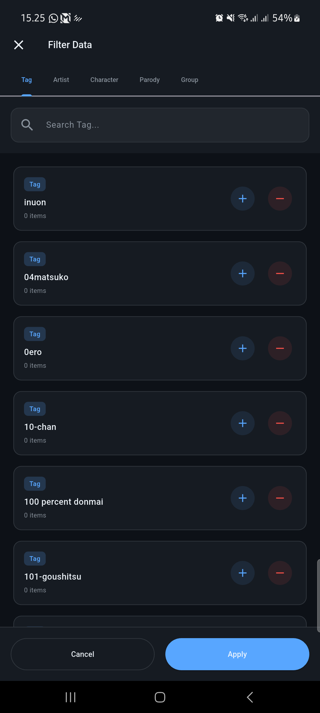

# 📱 NhasixApp - Pengalaman Membaca Mobile yang Ditingkatkan

[](https://flutter.dev)
[](https://dart.dev)
[](https://www.android.com)
[](#)
[](#)

> [!TIP]
> **[🇺🇸 Read in English](README.md)**

**Kuron** (sebelumnya NhasixApp) menghadirkan pengalaman membaca komik mobile **70% lebih cepat** dengan privasi sebagai prioritas utama. Dibangun dengan **Clean Architecture**, aplikasi ini fitur membaca offline cerdas, mode penyamaran (App Disguise), dan desain Material 3 yang modern.

---

## 📥 **Download Rilis Terbaru**

[📦 **Download v0.7.2**](https://github.com/shirokun20/nhasixapp/releases/tag/v0.7.2)

| Varian | Ukuran | Cocok Untuk | Status |
|:-------|:----:|:---------|:------:|
| **ARM64** | 24MB | HP Modern (2019+) | ✅ Tersedia |
| **ARM32** | 22MB | HP Lama (2015-2018) | ✅ Tersedia |

---

## ✨ **Fitur Utama**

### 🎯 **Membaca & Menjelajah**
- **Immersive Reader**: Mode layar penuh, transisi halus, dan rendering tajam.
- **Pencarian Cerdas**: Filter canggih berdasarkan tag, popularitas, dan tanggal.
- **Auto-Bookmark**: Lanjut baca dari halaman terakhir secara otomatis.

### 🛡️ **Privasi & Offline**
- **App Disguise**: Samarkan aplikasi menjadi Kalkulator, Catatan, atau Cuaca.
- **Download Pribadi**: Konten tersembunyi dari galeri HP (`.nomedia`).
- **Offline First**: Baca tanpa internet dengan download di latar belakang.
- **Export Library**: Backup seluruh koleksi beserta database untuk dibagikan atau dipulihkan.
- **Blur Thumbnail**: Thumbnail blur untuk privasi, aktif secara default.

### 🎨 **Performa & UX**
- **Loading Cepat**: Preloading gambar cerdas membuat bacaan 70% lebih lancar.
- **UI Adaptif**: Desain responsif dengan mode Gelap/Terang.
- **Hemat Baterai**: Penggunaan daya efisien dengan Wakelock dan caching.

---

## 📱 **Tangkapan Layar**

<details>
<summary>🖼️ Klik untuk melihat tangkapan layar (peringatan konten 18+)</summary>

<table>
  <tr>
    <td align="center"><b>Beranda & Feed</b></td>
    <td align="center"><b>Detail & Konten</b></td>
    <td align="center"><b>Mode Baca</b></td>
  </tr>
  <tr>
    <td></td>
    <td></td>
    <td></td>
  </tr>
  <tr>
    <td align="center"><b>Pencarian & Filter</b></td>
    <td align="center"><b>Pengaturan & Privasi</b></td>
    <td align="center"><b>Download & Offline</b></td>
  </tr>
  <tr>
    <td></td>
    <td></td>
    <td></td>
  </tr>
</table>

</details>

---

## 🛠️ **Teknologi**

| Layer | Teknologi |
|:------|:-------------|
| **Core** | Flutter 3.24+, Dart 3.5+ |
| **Arch** | Clean Architecture, BLoC Pattern, GetIt (DI) |
| **Data** | SQLite (Offline), SharedPreferences, Dio (Network) |
| **UI/UX** | CachedNetworkImage, PhotoView, Shimmer, Lottie |
| **System** | Local Notifications, Wakelock Plus, Permission Handler |

---

## 🚀 **Mulai Cepat**

### **Instalasi**
1. **Download APK** dari [Releases](https://github.com/shirokun20/nhasixapp/releases).
2. **Aktifkan Sumber Tak Dikenal** di Pengaturan > Keamanan.
3. **Install** dan nikmati!

### **Build dari Source**
```bash
git clone https://github.com/shirokun20/nhasixapp.git
cd nhasixapp
flutter pub get
flutter run
```

---

## 🆘 **Bantuan**

**FAQ**
- **Gagal Install?** Aktifkan "Sumber Tak Dikenal" dan pastikan varian CPU benar (ARM64 vs ARM32).
- **Gambar Hilang?** Cek koneksi internet atau hapus cache aplikasi.
- **Download Tidak Muncul?** Memang didesain privat agar tidak memenuhi galeri.

---

## 📜 **Lisensi & Legal**

**⚠️ Peringatan Konten 18+** • **Hanya Untuk Edukasi** • **Lisensi MIT**

Dilisensikan di bawah MIT License. Lihat [LICENSE](LICENSE) untuk detail.
Kami sangat mendukung kreator konten; mohon dukung rilis resmi jika memungkinkan.
