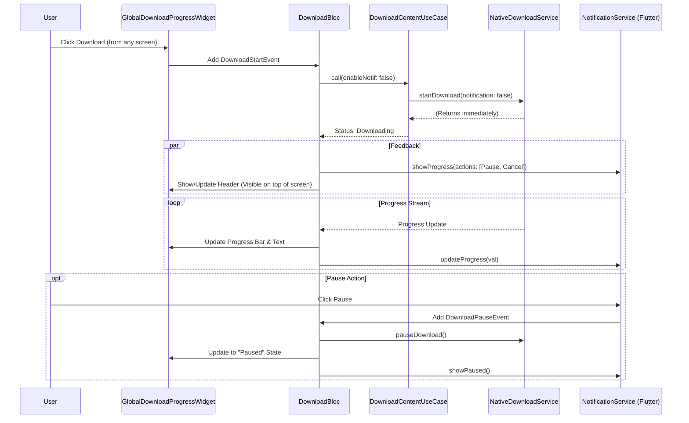

# Download Revamp Detailed Implementation Plan

## Goal Description
Revamp the download process to ensure a robust, non-blocking "fire-and-forget" flow. The system will shift entirely to **Flutter-side notifications** (`flutter_local_notifications`), strictly suppressing native-side notifications. 

**NEW:** A **Global Active Download Header** will be implemented to show active download progress across the app (Home, Details, Main Screen), not just in the Downloads screen.

## Architecture Overview

### Key Requirements
1.  **Notification Control**: 100% Flutter-based. Native notifications must be disabled.
2.  **Notification Actions**: Pause, Cancel, and Retry must be functional from the notification panel.
3.  **Global UI**: A persistent **Global Download Header** that appears on top of the app content when a download is active.
4.  **Flow**: Non-blocking Fire-and-Forget.

### Global UI Strategy
To ensure the download progress is visible on multiple screens (Home, Detail, etc.), we will integrate a `GlobalDownloadProgressWidget` into the main application scaffold wrapper (`AppScaffoldWithOffline` or root `MaterialApp` builder).

### New Flow (Proposed)

1.  **Initiation**: `DownloadBloc` triggers `DownloadContentUseCase`.
2.  **Fire-and-Forget**: UseCase calls `NativeDownloadService` with `enableNotifications: false`.
3.  **Local Notification**: `DownloadBloc` shows "Download Started" with **Pause** and **Cancel** actions.
4.  **Progress Stream**: Native layer emits progress events.
5.  **State Update**: `DownloadBloc` updates state.
6.  **Global UI Update**: The `GlobalDownloadProgressWidget`, listening to `DownloadBloc`, slides in or appears at the top of the current screen.
7.  **Notification Update**: `DownloadBloc` refreshes the notification progress.

## Visual Workflow



## Detailed Implementation Changes

### 1. Domain Layer: Fire-and-Forget UseCase

**File:** `lib/domain/usecases/downloads/download_content_usecase.dart`

```dart
Future<DownloadStatus> _performActualDownload(...) async {
  // STRICTLY DISABLE NATIVE NOTIFICATIONS
  await _nativeDownloadService.startDownload(
    // ... other params
    enableNotifications: false, 
  );
  return currentStatus;
}
```

### 2. Presentation Layer: Bloc Notification Control

**File:** `lib/presentation/blocs/download/download_bloc.dart`

The Bloc must handle the lifecycle of the global notification *and* the local notification.

```dart
Future<void> _onProgressUpdate(event, emit) async {
  // Update Notification with Actions
  if (state.settings.enableNotifications) {
      // Logic to determine if we should update specific action buttons
      // e.g. if paused, show Resume. If downloading, show Pause.
      _notificationService.updateDownloadProgress(
        contentId: event.contentId,
        progress: event.progressPercentage,
        title: download.title,
        isPaused: false,
      );
  }
  emit(newState);
}
```

### 3. Services Layer: Detailed Notification Actions

**File:** `lib/services/notification_service.dart`

We need deep integration for actions.

*   **Setup**:
    ```dart
    const AndroidNotificationDetails androidDetails = AndroidNotificationDetails(
        'download_channel', 'Downloads',
        channelDescription: 'Progress of file downloads',
        importance: Importance.low,
        priority: Priority.low,
        onlyAlertOnce: true,
        showProgress: true,
        maxProgress: 100,
        indeterminate: false,
        actions: <AndroidNotificationAction>[
            AndroidNotificationAction('action_pause', 'Pause', ...),
            AndroidNotificationAction('action_cancel', 'Cancel', ...),
        ],
    );
    ```
*   **Action Handling**: The `NotificationActionHandler` must intercept these IDs (`action_pause`, `action_cancel`) and route them to `DownloadBloc`.

### 4. UI/UX: Global Active Download Header

**New File:** `lib/presentation/widgets/global_download_progress_widget.dart`

This widget will be a `BlocBuilder<DownloadBloc>` that renders `SizedBox.shrink()` if no downloads are active, or a `Material` banner if there are.

```dart
class GlobalDownloadProgressWidget extends StatelessWidget {
  @override
  Widget build(BuildContext context) {
    return BlocBuilder<DownloadBloc, DownloadBlocState>(
      builder: (context, state) {
        if (state is! DownloadLoaded || state.activeDownloads.isEmpty) {
          return const SizedBox.shrink();
        }
        
        final active = state.activeDownloads.first;
        return Container(
          color: Theme.of(context).colorScheme.primaryContainer,
          padding: EdgeInsets.symmetric(vertical: 8, horizontal: 16),
          child: Row(
            children: [
               // Thumbnail
               // Title & Stats
               // Pause/Cancel Buttons
            ],
          ),
        );
      },
    );
  }
}
```

**Integration:**
We will inject this into `AppScaffoldWithOffline` or the main layout wrapper so it appears above the `body` but below the `appBar` (or even floating).

**File:** `lib/presentation/widgets/app_scaffold_with_offline.dart`

```dart
Widget build(BuildContext context) {
  return Scaffold(
     // ...
     body: Column(
       children: [
         // GLOBAL HEADER HERE
         GlobalDownloadProgressWidget(),
         Expanded(child: widget.body),
       ],
     ),
  );
}
```

## Execution Steps

1.  **Domain**: Force `enableNotifications: false`.
2.  **Global UI**:
    *   Create `GlobalDownloadProgressWidget`.
    *   Integrate it into `AppScaffoldWithOffline` (or equivalent layout).
3.  **Bloc & Notifications**:
    *   Implement "Pause", "Resume", "Cancel" actions in `NotificationService`.
    *   Wire up `DownloadBloc` to handle these events and update notifications accordingly.
4.  **Verify**:
    *   Start download -> Header appears on Home/Detail screens -> Notification appears (Flutter only).
    *   Pause from Header -> Notification updates to "Paused".
    *   Resume from Notification -> Header updates to "Downloading".
